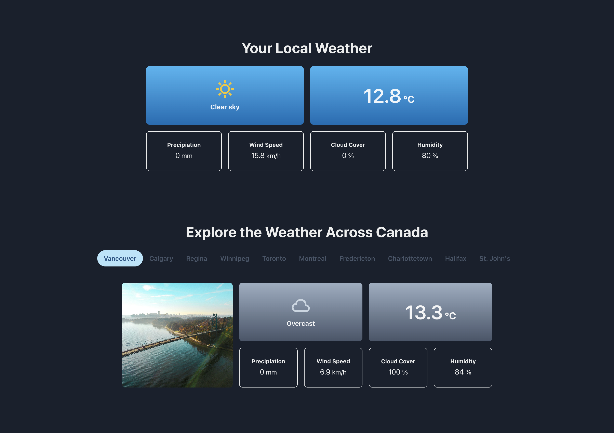

# The Weather | Canada

## Scope

This simple one-page weather app will show you the current weather in your location. It also allows you to browse the current weather across the major Canadian regions coast-to-coast.

> **Note**: To see the weather in your specific location you will need to give the browser permission to share that information.
>
> Some browser settings may limit popups. If you don't see location-specific weather and are not prompted for permission, look for a location icon in your address bar that may handle permissions or go to your broswer settings directly.

## Installation Instructions

1. Clone the repo

```
git clone git@github.com:mirandajoy/weather-canada.git
```

2. Install dependencies

```
npm install
```

3. Run the application locally

```
npm run dev
```

4. View and test client

To view and test the client, open the local application in the browser. It will default to running on port 5173. If that port is occupied it may run on a different port which will be indicated in your terminal.

```
http://localhost:5173/
```

If running correctly you should see the following interface:


5. View and test server

If desired, you can view and test the server independently by opening the local server URL in the browser. The server has been hard-coded to run on port 4000. If you'd prefer to run the server locally on a different port you can update the port in server/src/server.ts and client/src/main.tsx.

If making a change to the port you will need to restart the application to ensure the server code is recompiled.

```
http://localhost:4000/
```
